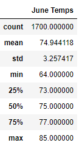
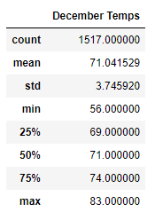

# surfs_up

## Overview of the analysis
The purpose of this analysis is to determine the temperature data for the months of June and December in Oahu, in order to determine if the surf and ice cream business is sustainable year-round.

## Results
Python, Pandas functions and methods, and SQLAlchemy were used on hawaii.sqlite to filter the date coumn of the Measurements table to determine the temperature data of June and December.

The following statistic temperature data tables for the months of June and December are displayed below:

Three key differences in weather between June and December are:
- The maximum temperature in June is 85 F, which is higher than the maximum temperature in December of 83 F. This indicate that June maxinimum temperature is 2 degree higher than December. Maximum temperature in June is slightly warmer than December.
- The miminmum temperature in June is 65 F, which is higher than the minimum temperature in December of 56 F. This indicate that the June minimum temperature is 9 degrees higher than December. Minimum temperature in June is slightly warmer than December.
- The mean temperature in June is 74.9 F and the mean temperature in December is 71.0 F. Overall, the mean temperature in June is higher than the mean temperature in December. However, the mean temperature in June is only slightly warmer than December.

## Summary
The analysis for temperature range in June and December are relatively close to each other in Oahu. The standard deviation is low in both months and it indicate that the surf and ice cream shop business is sustainable year round.

Two additional queries to gather more weather data for June and December:
- Find the number of windy days in June and the number of windy days in December
- Find the number of rainy days in June and the number of windy days in December.
